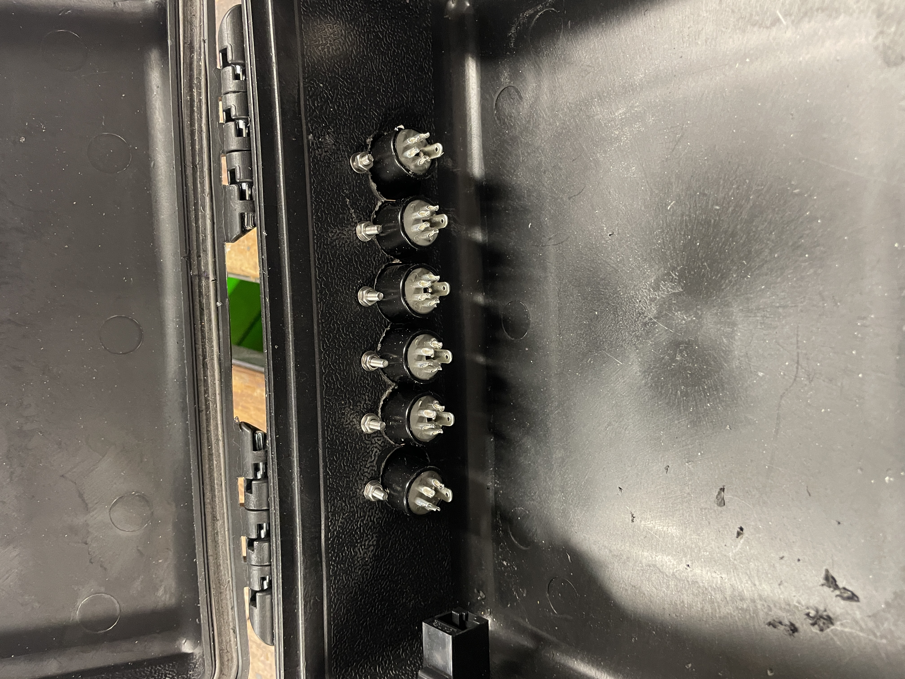
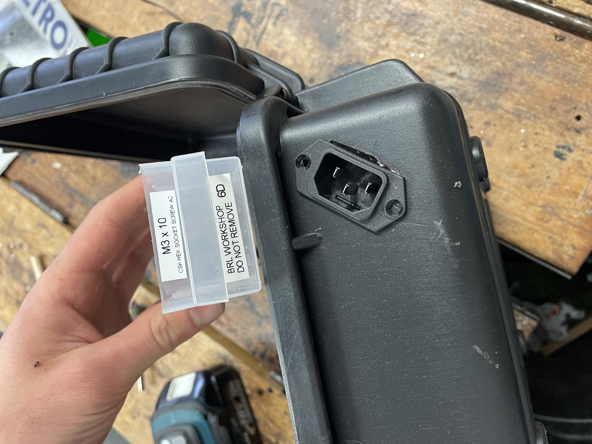
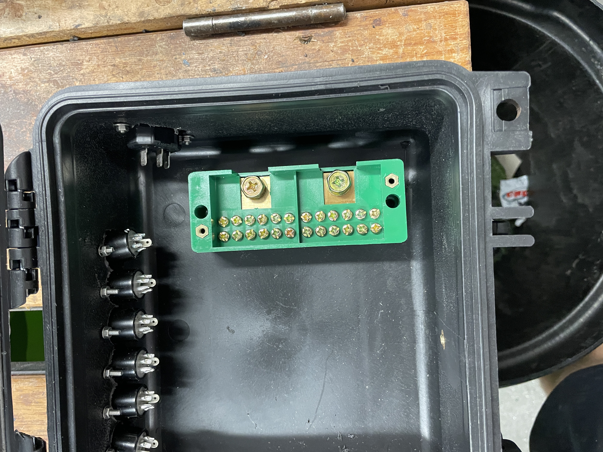
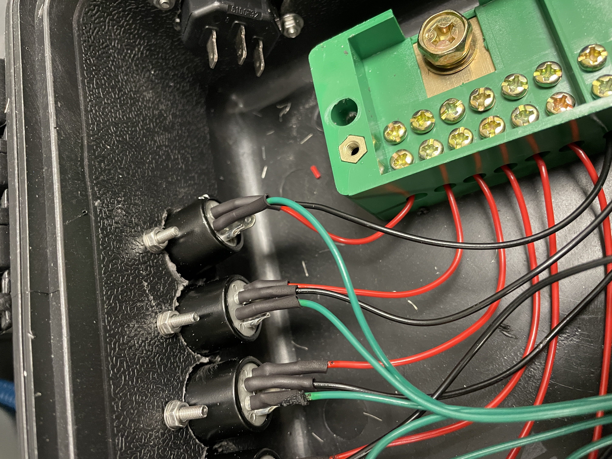
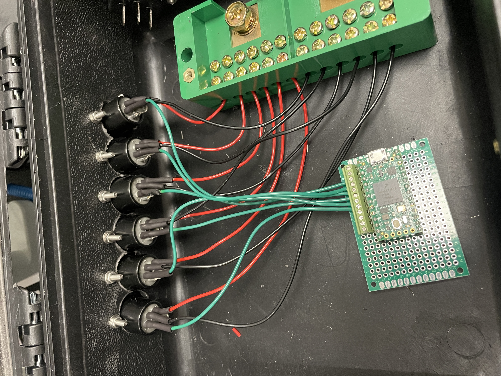
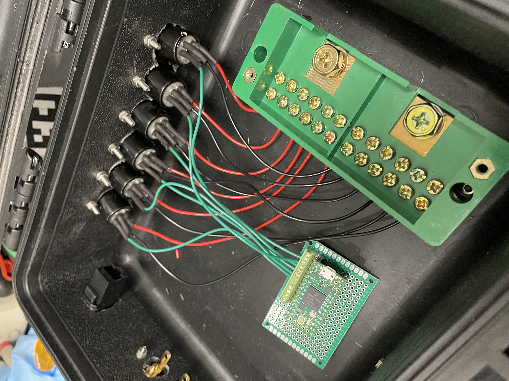
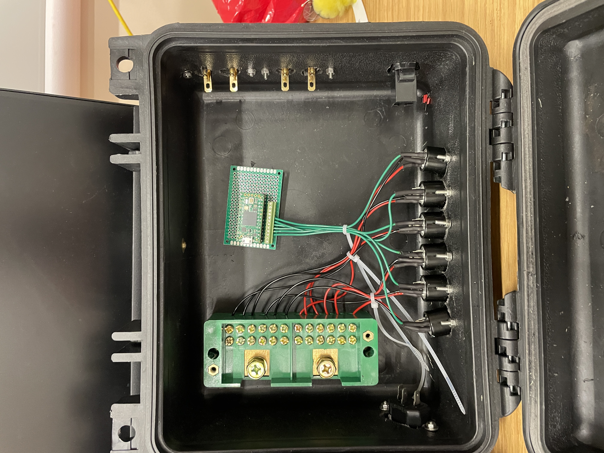
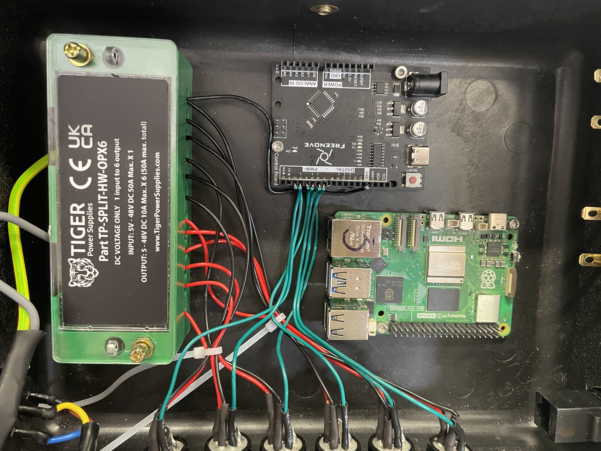
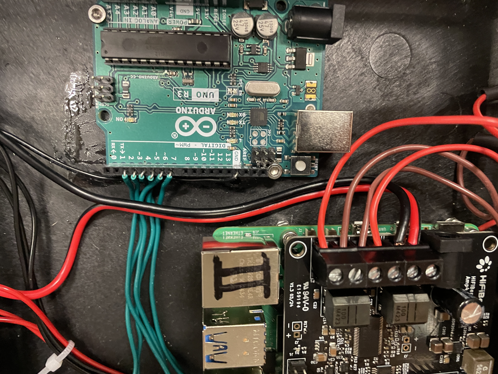
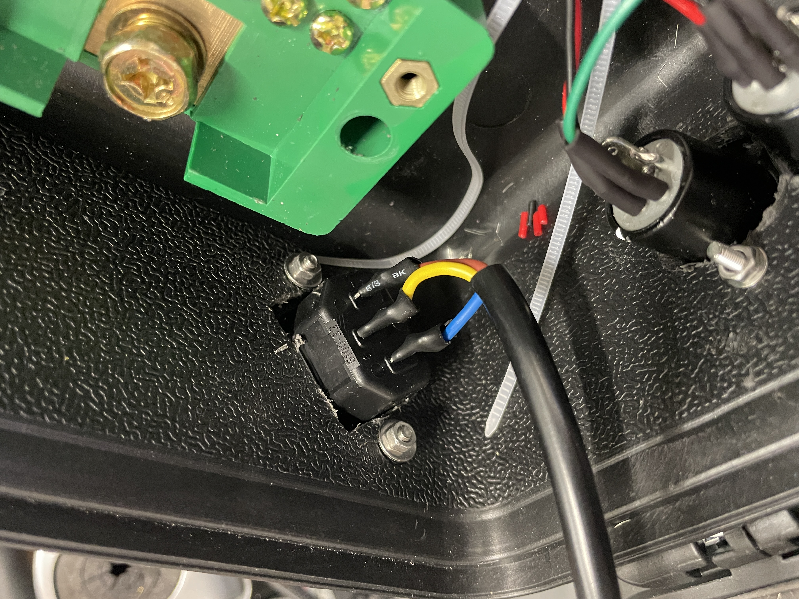

# Portable Forest Box - Hardware Build Documentation

This page details the build of the Portable Forest Box v1. It's v1 because this is the first attempt, there are probably a whole bunch of improvements that could be made but for now, it works. We've added as much detail as we can at this stage but feel free to reach out if anything is unclear and we can update with more detail / pics :)

## Bill of Materials

The table below is an overview of all the components needed. Some items are optional depending on the artistic use of the box. 

Some consumable items, (e.g. nuts and bolts) are vague because we don't have a record of exact values (sorry!). Selection packs for these kind of consumables are available online or many workshops have a selection freely available.

Note 1 - any of these components can be swapped out for others as long as the specs are checked. Teensy --> ESP32. Power supply --> different power supply. etc. 

Note 2 - this implentation is also not waterproof, it would be possible to build a waterproof one but special waterproof ports would be needed.

| Item | Quantity per box | Type | Notes |
|------|------------------|------|-------|
| [Raspberry Pi 5](https://uk.farnell.com/raspberry-pi/rpi5-16gb-single/rpi5-board-16gb-2-4ghz-arm-cortex/dp/4623090) | 1 | Compute | We used 16GB; 4GB probably enough but more RAM gives headroom. |
| SD card 128GB | 1 | Compute | |
| [Active Cooler for Raspberry Pi 5](https://thepihut.com/products/active-cooler-for-raspberry-pi-5) | 1 | Compute | Optional but good for peace of mind. |
| Arduino UNO | 1 | Compute | Can be swapped out for ESP32, Teensy, or others. |
| [Black Water Resistant Case with Foam Insert – 246×270×124mm](https://cpc.farnell.com/duratool/d03132/water-resistant-case-270x246x124mm/dp/SG33492) | 1 | Hardware | |
| [4-pin XLR sockets](https://cpc.farnell.com/cliff-electronic-components/fc6126/44-pin-male-xlr-socket/dp/CN20695?st=4%20pin%20xlr%20sockets) | 6 | Hardware | Can swap for 3/5/6-pin. Some faceplates are tight — choose narrow ones. |
| [Ethernet port](https://cpc.farnell.com/cliff-electronic-components/cp30220m/utp-adapter-rj45-jack-8p8c-cat5e/dp/CN20153) | 1 | Hardware | Optional but useful. |
| [Speaker cable panel mount](https://cpc.farnell.com/monacor/st-925gm/terminals-speaker/dp/AV19960) | — | Hardware | |
| Nuts and bolts | Various | Hardware | M3 10–25mm, mix of pan + countersunk; workshop assortments work well. TODO: check all sizes and add to this table.|
| Thread-locker (blue) | Various | Hardware | |
| Heat shrink | Various | Hardware | |
| [Power Supply – 12V 250W](https://ledsone.co.uk/products/led-driver-250w-waterproof-transformer) | 1 | Power | |
| [Power input port](https://cpc.farnell.com/schurter/61003200/c14-inlet-screw-48mm-tab/dp/CN20000) | 1 | Power | **Use a fused, closed-back port** to avoid exposure to mains contacts. |
| [DC Voltage splitter](https://cpc.farnell.com/tiger-power-supplies/tp-split-hw-opx6/dc-voltage-splitter-terminal-block-6way/dp/CN24184) | 1 | Power | Basic version used; fuse-box types safer but bulkier. |
| Wires | Various | Power | Includes LED data lines; exact spec varies. but all specified in the text below. TODO: add all sizes to text and to this table. |
| UK mains kettle lead | 1 | Power | Region dependent. |
| [HiFiBerry Amp4](https://onecall.farnell.com/hifiberry/4260439551085/amplifier-amp4-pro-for-raspberry/dp/SC21674) | 1 | Sound | |
| [Outdoor waterproof 4" speaker](https://cpc.farnell.com/adastra/bh4-b/bh4-spkrs-in-outdoor-pair-black/dp/LS05401) | 1+ | Sound | Many options; these work indoors and outdoors. |
| Speaker cable | 1+ metre | Sound | Length varies by placement. |
| Buttons | Optional | Optional | Depends on project. |
| LED | Optional | Optional | Depends on project. |

## Tools

Are variety of tools were used in the v1 build. Some are necessary, others could be worked around. An overview is give in the table below. Dimensions are provided where possible (where we remembered!).

| Tool                      | Importance | Info |
|---------------------------|------------|------|
| Electric drill            | Essential  | Used to drill the box for all fixtures and fittings. |
| Drill bits (3–8mm)        | Essential  | Half sizes (3.5mm, 4.5mm etc.) great for M-bolt holes. |
| Holes saw (TODO: check size!)        | Essential  | Used for all major side of box componenet mounts|
| Flat coarse hand file     | Optional   | Used to square drilled holes (e.g., Ethernet port). |
| Wire stripper             | Essential  | Trigger-style recommended for speed. |
| Soldering iron            | Essential  | Easy soldering; good beginner project. |
| Multimeter                | Essential  | Helps diagnose loose connections. |
| Screwdriver                | Essential  | Various sizex inluding tiny ones for screw terminals|
| Allen keys                | Essential  | Handy for bolts |
| Heat gun                | Essential  | Needed for heat shrink. Other options available. |
| Crimp tool / kit                | Optional  | Ideally used for crimping terminals but not essential. |
| Rubber mallet                | Optional  | Useful for one or two tasks only. |

# Step 1 - Drilling Holes for External Fixtures

External fixtures are any ports or connectors that face the outside of the box.

For each hole measure the location of the hole, some flexibility is allowed here, the locations do not need to be perfect but ensure enough room is left for all components. We recommend marking out all holes and fixtures sizes in pencil before drilling anything. (Note - we can do an engineering drawing of hole locations if this would be useful?).

The most useful tool for this was a *** mm (I will check exact size when next in the lab). The hole saw mounts to a standard electric drill and is the cleanest way to make a hole large enough for these components.

The following fixture holes are needed

- 4 Pin XLR LED ports
    - 6 holes in the back of the case - note that this is quite a tight fit so careful marking out needed
    - Start by marking out in pencil equidistant centre points
    - Use a 4 mm drill bit to first accurately drill the centre hole (see image of Avgi drilling below)
    - Use a  *** mm hole saw to drill the holes for the port. The previously drilled 4 mm holes act as guidance
    - Once the main hole is drilled, put the ports in place and drill the two smaller fixing holes, one in each corner (note this may differ if you buy different ports but the process is the same)
    - Fix with nuts and bolts  

  

  

  

- 3-pin mains supply 'kettle lead' power input (UK mains - other countries will vary and may have 2 pins only, lots of info available online for this)
    - Note there are several ways to make a rectangular hole in the case, this was our method (not the most elegant!)
    - Start by marking out in pencil the location of the power port - we put this at an angle as it was wider than the case was deep
    - Mark out in pencil the drilling area, marked by the protruding back of the power port - this is the part that needs to go through the box
    - Using an appropriately sized hole saw (we used *** mm) drill 2 overlapping holes that cover off most of the marked out drilling area
    - Use a coarse hand file to open up the holes such that the two overlapping hole saw holes become one combined rectangle, perfectly fitted to the power port
    - Once the main hole is in place, put the power port in place and drill the two smaller fixing holes
    - Fix with nuts and bolts

  

  

  

  

- Ethernet port (optional)
    - Same method as the 3-pin power port above but only one *** mm hols is needed
    - The only difference is that the referenced ethernet port works well as a press fit and not bolted in - this means a tight fit is essential so do not over drill or over file
    - A rubber mallet or similar can be used here to 'pursuade' the port into the hold with a firm tap

  

  

  

- Speaker terminals
    - Each speaker terminal has 2 inputs, this means two holes needed
    - Mark up holes
    - Use a large 8mm drill bit to drill the holes
    - Once drilled, place the ports and mark out then drill the holding bolt holes

  

  

  

Now we have a box with all side holes completed and all external fixtures fitted:

  

# Step 2 - Drilling Holes for Internal Mounting

Next is to mount the heavy internal components. To start we would recommend only fixing the power supply and the DC voltage splitter. The Pi and Microcontroller can be bolted in but do not have to be. It's good to have flexibility with these components at this stage in the build and makes wiring easier later.

The most useful tool for this was a *** mm drill bit (I will check exact size when next in the lab).

Note - we attached these by directly to the case, drilling through the case itself. This is not the neatest approach but it is the quickest. A neater method would be to build (e.g. a 4mm laser cut plywood sheet with lots of slots in) a mounting board and fix this to the inside of the case. This would also allow better reconfigurability but would decrease headroom in the case.

The 12V power supply is attached to the lid of the case. The DC voltage splitted is attached to the floor, in the deeper half of the case.

- 12 V power supply - attach to the lid of the case
    - Mounting holes are already on the part. Line these up and mark out
    - Drill hole one by one and recheck the other marked holes each time just in case things move out of place
    - Use same size drill bit as mounting holes
    - Fix with a washer on the inside and a countersunk (if possible) bolt on the outside
    - Note - the power supply is heavy so we actually removed it once holes were drilled and fitted it later - this makes the case easier to work with when doing other jobs like wiring.

  

- DC Voltage Splitter
    - Again mounting holes are on the part. Line up and mark out
    - Drill hole one by one and recheck the other marked holes each time just in case things move out of place
    - Use same size drill bit as mounting holes
    - Fix with a washer on the inside and a countersunk (if possible) bolt on the outside
    - Leave the top off ready for wiring

  

# Step 3 - Wiring the LEDs Power

So the voltage splitter is in, the LED ports are in - time to connect them!

The voltage splitter has two sides, positive and negative. WARNING - to avoid blowing up LEDs, these need to be the right way round. Select which side will be positive and which will be negative. Use red *** mm wire for the positive side and black *** wire for the negative side. Other colours also work but red and black is the most universally obvious choice.

For each LED connector, one red wire and one black wire need to be connected. Each pin on the XLR port is numbered. It is important to align the numbers used on the ports (male end) with those used on the LED cables (female end). The following convention is used:

- Pin 4: Positive 12V (red wire)
- Pin 3: Negative 12V i.e. ground (black wire)
- Pin 2: Data from Arduino
- Pin 1: Empty - this could be used for buttons, touch sensors etc etc

With that in mind, the positive and negative wires can be measured in length from 12V DC splitter to each XLR port. Use Wire stripped to take of approx 5mm of cable cover on each end. 

At the DC splitter end, partly unscrew two bolts per terminal, place wire and clamp down with bolts.

*IMPORTANT* - add heat shink now. This is needed to protect the soldered side.

Solder the the other end onto the XLR cable, wait for it to cool, slide over heat shrink and apply heat to seal.

Repeat for all 6 XLR ports, positive and negative - 12 total.

  

  

  

# Step 4 - Arduino Wiring

Next is to wire up the data pins from the XLR ports.

There are several ways to do this and it depends primarily on which microcontroller is used. The solution below was done for speed as we were having issues with the Teensy so we switched last minute to the Arduino. A better method would be to use screw terminals or similar and a custom build proto-board with mountings for the micro-controller. 

Instead we used a slightly less secure method of single core cable directly inserted into the Arduino board header pins. This is a great method for prototyping but not secure and may come loose when travelling etc.

Start by positioning the Arduino in the box - this can be fixed down with bolts or tape. 

As with the power cables, measure out the length of cable for each port from the selected pins (e.g. Pins 1-6 on the Arduino). Using the *** mm, single core cable, cut and strip each. Solder to Pin 2 on the XLR port and simply insert into the relevant header pin on the Arduino.

  

  

Finally we need to connect the grounds. With all the LEDs wired in there will be no spare terminals on the splitter. We get around this by doubling up some terminals with two cables in each. This again is not the most elegant method but the current draw from the LEDs is low so it is passable for this use case. This is an area for future improvement however!

Connect grounds:
    - The Arduino is currently powered via USB from the Pi - this is because we are using serial to transfer data between the two
    - However, the Arduino needs to share a ground with the LEDs for the data circuit to work
    - So run a single, *** mm cable from one of the ground terminals to a ground pin on the Arduino
    - Note - if the LEDs are doing some weird flashing, it is often a loose or dodgy ground connection so check here first

  

# Step 5 - PI Wiring

Add the HiFi Berry Amp hat onto the Pi. Position the Pi in the box, again this can be fixed in place, we chose to bolt the Pi in place. We also chose to use several spacers (bolts and washers) beneath the Pi such that it was not touching the case. This was to maximise air flow for cooling.

First we need to power the Pi.

Again there are no spare terminals on the DC splitter so we need to double up terminals here with one positive and one negative LED output. The process is as follows:
    - The Pi is powered from via the HiFi Berry
    - The HiFi berry takes a 12V input. WARNING - make sure the wires are the correct way round, we have burnt out a few amps by getting this the wrong way round (ooops!)
    - The amp is fairly high power so we recommend using a thicker *** mm cable for both the positive and negative inputs here
    - Cable size: *TBC*

Next is the speakers. The HiFi Berry is a powered amplifier, this means that it sends signals to an unpoweered speaker - it provides both power for the speaker cone to move and the signals to make it move in a way that produces the sounds we want it to. Each speaker has two inputs, positive and negative. The HiFi Berry has outputs for two speakers, Left and Right.

Wiring these up is the same as the DC power 
    - Positive and negative terminals are connected, conventionally using red and black speaker cable
    - Use screw terminals on the HiFi Berry
    - Solder (with heat shrnk!) to the audio terminals
    - Cable size: *TBC*

  

  

  

# Step 6 - Powerrrrr!

Ok its time to fire this thing up!

**WARNING** - This is the most dangerous part. Be careful when handling exposed electronics when powering up or when powered on. 

In particular:

- Mains port - as noted above, we recommend a covered and fused safety port for the kettle lead, this is directly connected to mains so is high risk. Extreme care is recommended here and plenty of precautions such as heat shrink and plastic casings should be in place to prevent exposure to live cables

- 12V wires - any two 12V cables, positive and negative, that touch each other, will cause a short. This can cause sparks and even fires. Take care before powering up to ensure that ALL cables are secured and that there are no loose cables that might be able to touch one another. Take precautions with heat shrink, trimmed cable ends and plastic casings.

- 12V terminals - any two 12V terminals, positive and negative, that when connected, will cause a short. This can cause sparks and even fires. Take care when powering up to ensure that ALL terminals are covered. The 12V DC splitter comes with a neat plastic cover for this reason. Do NOT power up without this cover applied. Even an accidental drop of a metal object, like a screwdriver, can cause a short.

- Speaker cables and small screw terminal cables are not as much of a risk but shorts should still be avoided. Take precautions with heat shrink and plastic covers.

If unsure double check with an experienced technical person or call one of the CA:VE team for a check over!

Connecting the power supply:

Attach the power supply by bolting into the lid via the previously drilled holes.

There is an input and an output to the power supply. Sometimes there are multiple outputs but we only need one. Usually there is a wiring diagram either printed on the power supply or in the datasheet. Triple check this and make sure it is connected correctly!

*Input*

Cable size: *TBC*

From UK mains (other countries will vary) - there is Live, Neutral and Ground. These are usually colour coded but again refer to datasheets to be sure. The kettle lead power port installed before connects to a standardised UK mains kettle lead, again lots of info available online but triple check the connection here as it can be confusing with the different male / female ends of the connector. Solder or otherwise connect the mains power port pins to the input of the power supply.

**WARNING** - this is the part where the highest voltage is moving through the system, hence this needs to be heavily protected from exposed wires. Exposure to mains power can be fatal. In the v1 box we used a kettle lead power port with exposed rear pins, we then used PLENTY of heat shrink to reduce the risk of exposure. It is recommended to take this a step further and use a properly covered port with pre-soldered cables. Heat shrink should still be applied.

  

  

**WARNING** - this is the port where the highest voltage is moving through the system, hence this needs to be protected from exposed wires / terminals. Exposure to mains power can be fatal. 

In the v1 box we used a kettle lead power port with exposed rear pins, we then used PLENTY of heat shrink when connecting the cables (see later steps) to reduce the risk of exposure. It is recommended to take this a step further and 3D print a terminal cover - this can simply screw onto the back of the terminal once soldered to reduce risk of contact further. A fairly poorly generated GPT image below gives a flavour for this:

  

*Output*

Cable size: *TBC*

The output is 12V, positive and negative. Sometimes there are multiple outputs but only one is needed. Ensure that all unused outputs are properly clipped and sealed to reduce risk of a short. Connect the positive 12V output to the positive terminal on the DC voltage splitter. Do the same fo the negative. The best way to connect this is to use a crimped circular connector - see below.

  

  

Crimp connector - used to connect to the +ve and -ve screw terminals on the DC voltage splitter.

  

Powering on:

We now have a nicely wired up box! 

  

We recommend powering on in the following steps. This does require unataching some of the cables you just wired in (sorry!). This is optional and you can power on all at once but this is a good method to make sure everything works as planned.

1. XLR ports only - disconnect power to the Pi and remove the ground to the Arduino. Turn on the power supply. One by one with a multimeter, confirm the following:
    a. 12V is going into the 12V voltage splitter
    b. 12V is coming out of each terminal of the voltage splitter
    c. 12V is reaching each of the XLR terminals

2. XLR ports + Pi - connect power back to Pi (double check correctly connected before powering on). Turn on the power supply. With a multimeter, confirm the following:
    a. 12V is going into the HiFI Berry
    b. 12V is going into the Pi - if all is well the Pi lights will turn on

3. XLR ports + Pi + Aruino + Lights! - connect the Arduino ground, connect a test strip of LEDs to an XLR port (female XLR needed - see below). Turn on the power supply. With a multimeter, confirm the following:
    a. Pretty lights on the LED strip!
    b. If no lights - use multi-meter to debug

# Step 7 - Adding Peripherals

Great so the box is built, the power is flowing, everything is working nicely. Time for the fun part - adding interactions.

This is completely flexible depending on the use case but below are a few things to play with to get going.

*LEDs*

- LED lights are powered and controlled via the XLR pins
- In reality anything that needs +12v, ground and data can be attached here
- A cable needs to be built to connect the LEDs - this needs an XLR male connector - the pins should align to those described above for +12V, ground and data. The pin numbers should be the same on the male connector as on the female port mounted in the box but double check this before soldering
- The other end of the cable can be any 3-pin connector or solder direct to an LED strip
- Each LED strip will be different but we have been using addressable WS2811 - ensure that the chosen strip has the correct pin configuration and is 12V compatible

*Buttons*

- We played with buttons on the v1 box
- These can theoretically be included in the XLR ports on the empty pin (Pin 1)
- However this can limit where the buttons are placed as they would use the same cables as the LEDs
- In our version we used seperate cables direct from the Arduino
- These were not attached via ports, instead they were routed through a hold in the front of the box, near the handle
- More permenant solutions could be implemented here as a future improvement - I2C buses or similar would be a fun one to play with!

*Arduino - Pi comms*

- For the v1 box we use a USB cable between the Pi and the Arduino to both power the Arduino and send serial messages
- Serial is rubbish lets be honest but it's ok for simple use cases
- Other options could be to wire up I2C or UART - something to work on in the future

*Other*

- The world is your oyster - have a play and report back!

Here's some bonus pictures on putting all these together :D

  

  

  

  

That's it! Have fun :D
